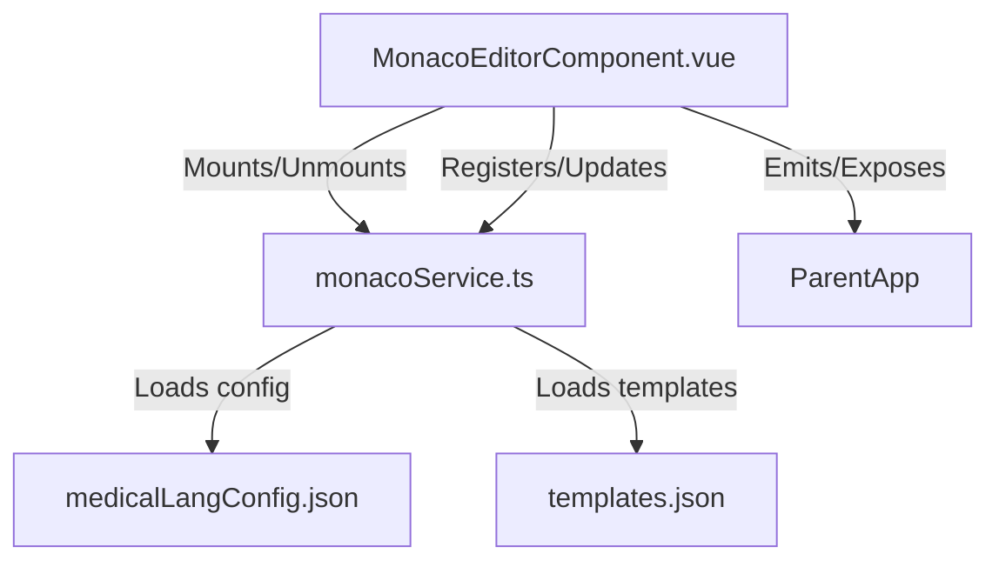

# Monaco Editor Integration Plan (Single Service, Clean Slate)

## 1. Project Structure

- `src/components/MonacoEditorComponent.vue`  
  *Vue component: handles mounting, props, emits, and exposes editor API.*

- `src/services/monacoService.ts`  
  *Single service: handles editor creation, language, theme, actions, keybindings, model management, completions, and all Monaco customisation.*

- `src/config/medicalLangConfig.json`  
  *Language and theme config.*

- `public/templates.json`  
  *Templates for completions.*

---

## 2. Lifecycle & Integration Flow

**On Component Mount:**
1. **Theme & Language Registration**
   - Register custom language and theme (from config).
   - Allow dynamic switching (via props or API).
2. **Editor Creation**
   - Create editor instance with merged options (default + props).
   - Attach to container.
3. **Model Management**
   - Set initial value, language, and model.
   - Support external updates (v-model).
4. **Custom Actions & Keybindings**
   - Register custom actions (e.g., template insertion, navigation).
   - Register keybindings (e.g., Ctrl+S for save, domain-specific shortcuts).
5. **Completions & Templates**
   - Register completion and inline providers.
6. **Expose API** (see section 6 for details)
   - Expose editor instance and utility methods (focus, get/set value, trigger actions).

**On Unmount:**
- Dispose editor and clean up listeners.

---

## 3. Editor Options & UX

- **Default Options:**
  - Word wrap, font, minimap, smooth scrolling, line numbers, etc.
  - Theme and language settable via props.
  - Read-only mode support.
  - Accessibility and performance tweaks.

- **Extensibility:**
  - Allow parent to pass additional options.
  - Allow dynamic updates to options, theme, and language.

---

## 4. Custom Actions & Keybindings

- **Action Examples:**
  - Insert template (open dialog, pick, insert)
  - Jump to next/previous section (domain-specific navigation)
  - Format note (custom formatting)
  - Trigger save (Ctrl+S)
  - Toggle read-only

- **Keybinding Examples:**
  - Ctrl+S: Save
  - Ctrl+Space: Trigger completions
  - Ctrl+Shift+T: Insert template

- **Implementation:**
  - Use Monaco’s `addAction` API in `monacoService.ts`.
  - Register actions on editor creation.

---

## 5. Theme & Language Switching

- **Theme:**
  - Register custom themes (from config).
  - Allow switching via prop or exposed method.
  - Support light/dark and domain-specific themes.

- **Language:**
  - Register custom language.
  - Allow switching via prop or exposed method.

---

## 6. Exposing Editor API (Detailed Explanation)

**Purpose:**  
Allow parent components or other parts of the app to interact with the Monaco editor instance directly, enabling advanced use cases and integration.

**What to Expose:**
- The Monaco editor instance itself (for full API access).
- Utility methods for common operations, such as:
  - `focus()`: Focus the editor programmatically.
  - `getValue()`: Get the current editor content.
  - `setValue(value: string)`: Set the editor content.
  - `triggerAction(actionId: string)`: Programmatically trigger a registered action (e.g., format, save, custom actions).
  - `setTheme(themeName: string)`: Change the editor theme at runtime.
  - `setLanguage(languageId: string)`: Change the language mode at runtime.
  - `updateOptions(options: object)`: Update editor options dynamically.
  - `getModel()`: Access the current Monaco model for advanced operations (decorations, markers, etc.).

**How to Expose:**
- In Vue 3, use `defineExpose` in the component’s `<script setup>` to expose these methods/objects to the parent via template refs.
- Example:
  ```ts
  // In MonacoEditorComponent.vue
  defineExpose({
    editorInstance,
    focus,
    getValue,
    setValue,
    triggerAction,
    setTheme,
    setLanguage,
    updateOptions,
    getModel
  });
  ```
- The parent can then use `ref="monacoEditor"` and call these methods directly.

**Benefits:**
- Enables parent components to control the editor (e.g., focus on open, save on command, insert templates).
- Supports advanced workflows (e.g., programmatic formatting, diagnostics, decorations).
- Makes the component more reusable and powerful.

---

## 7. Integration Points

- **Events:**
  - `update:modelValue` (v-model)
  - `editorMounted` (editor instance ready)
  - `onAction` (custom actions triggered)

- **Props:**
  - `modelValue`, `language`, `theme`, `options`, `readOnly`

- **Emits:**
  - Value updates, editor ready, action events

---

## 8. Architecture Diagram (Mermaid)



---

## 9. Implementation Steps

1. **Create `monacoService.ts`**:  
   - Implement all Monaco logic: editor creation, language, theme, actions, completions, etc.

2. **Rewrite `MonacoEditorComponent.vue`**:  
   - Use the new service, expose API, handle props/emits, and lifecycle.

3. **Add/Update Config Files**:  
   - `medicalLangConfig.json` for language/theme.
   - `templates.json` for completions.

4. **Document Exposed API**:  
   - Add JSDoc/comments for all exposed methods.

---