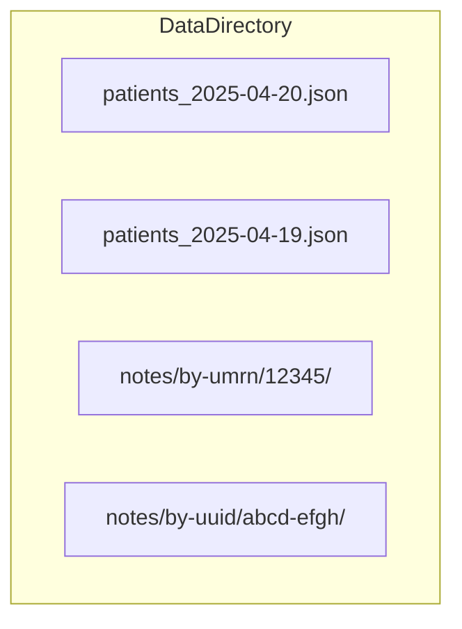
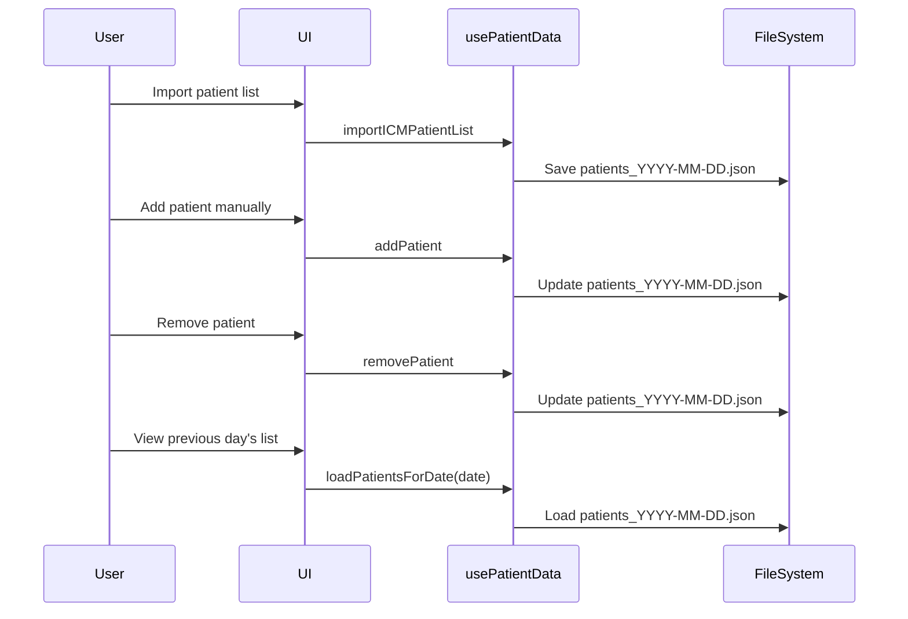

# Patient List Management System – Design & Implementation Plan

## 1. Data Model & File Structure

- The app always loads and modifies the current day's patient list file:  
  `patients_YYYY-MM-DD.json` (e.g., `patients_2025-04-20.json`).
- No separate `patients.json` file is maintained.
- Patient notes remain in their current directories and are never deleted by list changes.

## 2. Import/Update Mechanism

- **Full import, manual additions, and removals** all update the current day's `patients_YYYY-MM-DD.json` file directly.
- When viewing or editing a historical list, the app loads the corresponding `patients_YYYY-MM-DD.json` for that date.

## 3. Data Persistence

- Patient notes and directories are never deleted by removal from the active list.

## 4. Historical Data Access

- UI controls allow the user to select a date and load the corresponding `patients_YYYY-MM-DD.json`.
- Multi-select and "add to today's list" from historical lists is supported.

## 5. Manual Patient Addition

- Additions are made only to the currently loaded day's file.

## 6. Integration with Existing Code

- **Backend:**  
  - Add snapshot save/load logic.
  - Refactor add/remove to operate on the loaded file.
  - Add load-by-date functionality.
- **Frontend:**  
  - Add date navigation.
  - Add multi-select, add/remove features.
  - Add sorting/filtering controls.

## 7. Scalability & Performance

- File-based snapshots are scalable for large datasets.
- Notes are already organized per-patient.

## 8. Removal Functionality

- Patient removal only updates the list file, never deletes notes.

## 9. Libraries & Vue Features

- **Sorting:**  
  - Vuetify's `v-list` with `v-sortable`, or [`vue-draggable-next`](https://github.com/anish2690/vue-draggable-next).
- **Filtering:**  
  - Simple search box with computed filtering.

## 10. Implementation Roadmap

1. **Backend:**  
   - Add snapshot logic.
   - Refactor add/remove.
   - Add load-by-date.
2. **Frontend:**  
   - Add date navigation.
   - Add multi-select, add/remove, sorting/filtering.
3. **Testing:**  
   - Ensure data and notes persist.
   - Test historical navigation and restoration.

---

### Mermaid Diagram: File Structure

---

### Mermaid Diagram: Patient List Management Flow

---

**This plan is now ready for implementation.**