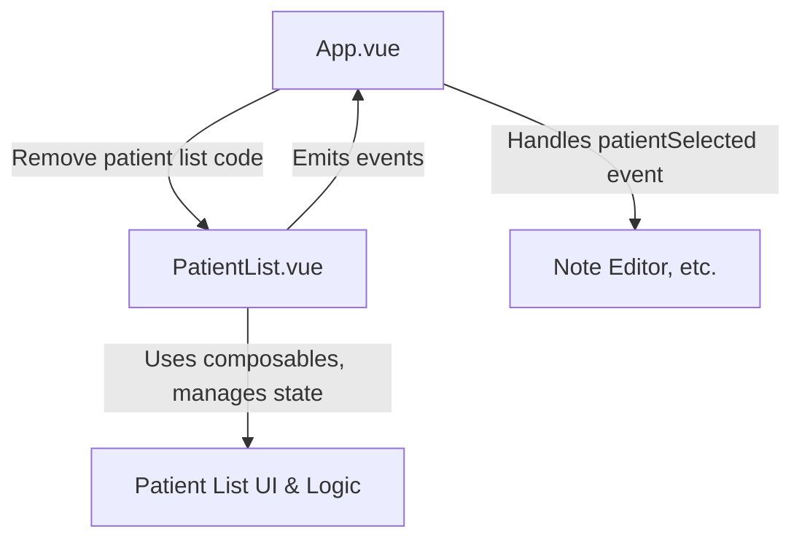

# Plan: Abstract Patient List into a Smart Vue Component

## Objective

Abstract the patient list UI and logic from `src/App.vue` into a new, self-contained Vue component (`PatientList.vue`) that manages its own state and logic using composables, and emits only high-level events to the parent.

---

## 1. Identify Patient List Boundaries

- **Template**: The patient list is contained within the `<v-navigation-drawer>` (lines 73–158 in App.vue).
- **Logic**: All code in the script section related to patient list state, composables, and handlers (e.g., usePatientList, handlePatientClick, handleAddNewPatient, etc.).
- **Dependencies**: usePatientList, usePatientData, useSnackbar, useConfig, and possibly others.

---

## 2. Design of `PatientList.vue`

### File Location
- `src/components/PatientList.vue`

### Component Responsibilities
- Encapsulate all patient list UI and logic (search, selection, multi-select, add/remove, edit mode, drag-and-drop, etc.).
- Use relevant composables internally (e.g., usePatientList, usePatientData).
- Emit high-level events to the parent (e.g., patientSelected, patientListChanged).

### Props
- Minimal: Only what is absolutely necessary from the parent (e.g., config state, snackbar function, or nothing if all can be handled internally).

### Emits
- `patientSelected(patientId: string)`
- `patientListChanged()` (optional, for parent to react to list changes)

### Internal State/Composables
- usePatientList
- usePatientData
- useConfig
- useSnackbar (can be provided/injected or imported)
- useDisplay (for responsiveness)
- Any other relevant composables

### Template
- Move the entire `<v-navigation-drawer>` content into PatientList.vue, adjusting references as needed.

---

## 3. Refactor `App.vue`

- Remove the patient list code from both the template and script.
- Import and use `<PatientList @patientSelected="..." />` in place of the old drawer.
- Handle only high-level events from PatientList (e.g., update selectedPatientId when a patient is selected).

---

## 4. Implementation Steps



1. **Create PatientList.vue**:
    - Copy the drawer template and relevant script logic.
    - Set up emits for high-level events.
    - Use composables internally.

2. **Update App.vue**:
    - Remove patient list code.
    - Import and use PatientList.vue.
    - Listen for events and update state as needed.

3. **Test**:
    - Ensure all patient list features work as before.
    - Confirm App.vue receives and handles events correctly.

---

## 5. Additional Considerations

- **Injection/Provide**: If snackbar or config state is provided from App.vue, use Vue’s provide/inject.
- **Styles**: Move any relevant styles to PatientList.vue.
- **Types**: Import any required types (e.g., Patient) into PatientList.vue.

---

## 6. Example Usage

In App.vue:
```vue
<PatientList @patientSelected="onPatientSelected" />
```
In PatientList.vue:
- Use composables, manage state, and emit `patientSelected` when a patient is clicked.

---

## Next Steps

- Confirm this plan or suggest changes.
- Once confirmed, proceed to code implementation.